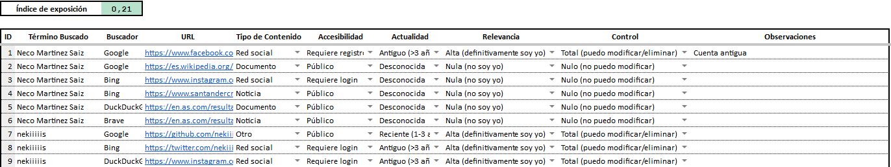
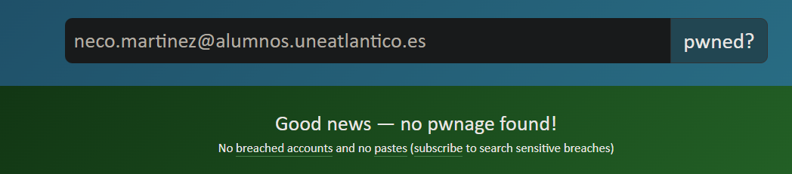

# 2022020012

## Análisis básico

Estas pruebas se han realizado utilizando el modo incógnito para evitar sesgos.

### EgoSurfing

## Análisis de plataformas

### Redes Sociales Tradicionales
| Plataforma   | Presencia | Observaciones |
|--------------|-----------|---------------|
| Facebook     | Sí        |               |
| Instagram    | Sí        | Uso moderado. |
| LinkedIn     | No        |               |
| X            | Sí        | Bastante uso. |

### Plataformas Emergentes
| Plataforma   | Presencia | Observaciones |
|--------------|-----------|---------------|
| BeReal       | No        |               |
| Threads      | No        |               |
| Mastodon     | No        |               |
| Discord      | Sí        | Bastante uso. |
| Bluesky      | No        |               |
| Letterboxd   | No        |               |

### Alias y Usuarios Detectados
- **Foros especializados**:
    - **GitHub**: nekiiiiis
      *(Cuenta de GitHub con uso académico)*

- **Plataformas gaming**:
    - **Steam**: nekis
      *(Bajo uso)*
    

### Interconexión entre Plataformas

**Patrón de usernames**:
    - `nekiiiiis` como base común en:
        - GitHub (`@nekiiiiis`)
        - Instagram (`@nekiiiiis`)
        - Twitter/X (`@nekiiiiis`)

**Conexiones específicas**:
    - **Discord → X**:
        - La cuenta de Discord esta conectada y vinculada a mi cuenta de X

### Conclusiones Plataformas

- Siempre trato de mantener abiertas las cuentas de servicios que utilizo activamente.

## Verificación de seguridad

### Exposición en brechas de datos

Utilizando la herramienta [Have I Been Pwned](https://haveibeenpwned.com/) encontramos los siguientes resultados:

- **Observaciones Adicionales**
    - Siempre uso alias de correo electrónico para mantener mi privacidad y protegerme contra este tipo de filtraciones.

### Permisos de aplicaciones
| Aplicación  | Permisos Concedidos | Nivel de Riesgo | Acción Requerida |
|-----------------------|----------------------|-----------------|-------------------|
| 

 | Ubicación (Al usarse), Fotos, Micrófono, Cámara | Alto | Limitar accesos innecesarios |
| 

 | Ubicación (Siempre), Contactos, Micrófono, Cámara | Muy alto | Desactivar todos los permisos que se utilizan cuando estoy fuera de la aplicación |
| 

 | Fotos, Micrófono, Cámara | Medio | - |
| 

 | Ubicación (Al usarse) | Bajo | Al desactivar la cronología de la cuenta de Google, el riesgo baja significativamente |

### Servicios vinculados
| Proveedor | Aplicaciones Conectadas                                       | Nivel de Acceso | 
|-----------|---------------------------------------------------------------|-----------------|
| **Google** | Servicios de Google, cuentas creadas con mi cuenta de Google. | Parcial         | 
| **Apple** | iCloud, App Store, Apple TV, todos los servicios de Apple.    | Completo        |

### Interacciones con IA
| Plataforma IA | Tipo de Interacción                 | Datos Compartidos | Configuración Privacidad |
|---------------|-------------------------------------|--------------------|--------------------------|
| **ChatGPT** | Preguntas académicas                | Textos académidos | No guardar datos en memoria |
| **GitHub Copilot** | Preguntas de desarrollo de software | Fragmentos código | No existe |
